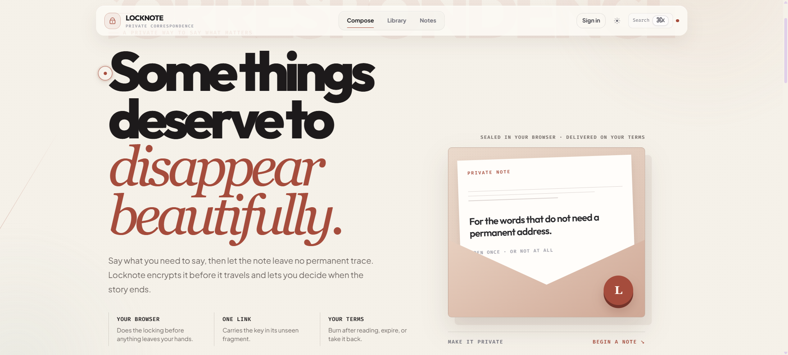
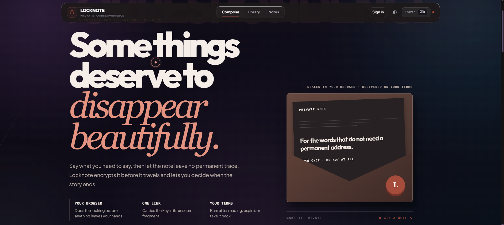

# Locknote

> **A private way to say what matters.**

Locknote is a zero-knowledge, self-destructing note-sharing application. It encrypts each note **in the browser before upload**, stores encrypted envelopes only, and gives the sender control over expiry, burn-on-read delivery, dead switches, file sharing, receipts, and remote withdrawal.

[](https://nodejs.org/)
[](https://react.dev/)
[](https://supabase.com/)
[](https://vercel.com/)

## Evaluation at a glance

Locknote is documented and tested as a complete submission rather than a visual prototype. The material below maps directly to the evaluation criteria.

| Evaluation criterion | Review-ready evidence |
| --- | --- |
| **Problem Understanding & Core Functionality** | Browser-side encryption, fragment-keyed sharing, burn-on-read, expiry, remote withdrawal, encrypted files, and delivery receipts. |
| **Innovation & Meaningful Differentiation** | Dead switches, seal fingerprints, passphrase gates, encrypted file envelopes, and pre-seal realtime collaboration. |
| **Technical Implementation & Architecture** | React/Vite client, Web Crypto API, Express/Zod/Helmet API, Supabase services, Vercel functions, RLS migrations, and typed tests. |
| **User Experience & Accessibility** | Intentional compose-to-share workflow, theme support, keyboard command palette, semantic controls, responsive views, and actionable errors. |
| **Performance & Reliability / Demo Quality** | Health endpoint, validation, rate limits, protected maintenance, production smoke test, and automated checks. |
| **Documentation & Explanation** | This README plus dedicated evaluation, demo, architecture, security, API, testing, comparison, and environment guides. |

> Start with the **[Evaluation Guide](docs/EVALUATION.md)** for a rubric-by-rubric explanation, then use **[DEMO.md](docs/DEMO.md)** for a repeatable evaluator walkthrough.

## Interface

<p align="center">
  
</p>

<p align="center">
  
</p>

<p align="center"><em>Locknote’s private-correspondence interface in light and dark themes.</em></p>

## Demo

| Resource | Link |
| --- | --- |
| Live application | `https://lock-note-sigma.vercel.app/` |
| Video walkthrough | **Add your video link here:** `https://YOUR-DEMO-VIDEO-URL` |
| Evaluator demo script | [docs/DEMO.md](docs/DEMO.md) |
| Rubric evidence guide | [docs/EVALUATION.md](docs/EVALUATION.md) |
| Local application | `http://localhost:5173` |
| Local API health check | `http://localhost:3001/api/health` |

> The live application is deployed on Vercel. The screenshots above show the supplied light and dark homepage views.

## Features

| Capability | Description |
| --- | --- |
| **Browser-side encryption** | The client encrypts content with AES-256-GCM before calling the API. The API persists ciphertext, salt, IV, and non-secret delivery metadata only. |
| **Fragment-keyed links** | The decryption key lives after `#` in the share URL. Browsers do not send URL fragments in HTTP requests, so the server never receives the key. |
| **Passphrase gate** | A sender can add an extra passphrase-based key derivation layer before sharing. |
| **Burn after reading** | A note can be consumed exactly once; a successful non-owner read makes further reads unavailable. |
| **Expiry and dead switches** | Notes can expire at a set time or disappear after an inactivity window. |
| **Remote withdrawal** | The owner capability lets a sender delete a still-active note and its encrypted file blob. |
| **Encrypted file envelopes** | Files are encrypted in the browser and stored as encrypted objects in the Supabase `secrets` bucket. |
| **Receipts and owner preview** | The owner can preview a note without burning it, inspect delivery metadata, and retrieve view receipts. |
| **Realtime collaboration drafts** | Temporary draft rooms use Supabase Realtime and are sealed or automatically purged after inactivity. |
| **GitHub sign-in** | GitHub OAuth is handled by Supabase Auth; GitHub credentials stay in Supabase provider configuration, never in the browser bundle or API source. |
| **Personal library** | The dashboard keeps links created in the current browser available for copying, receipt checks, and withdrawal. |

## Security model

Locknote is designed around one boundary: **the server can store an encrypted envelope, but it must not receive the decryption key**.

```text
Browser
  ├─ generates encryption material
  ├─ encrypts note or file locally
  ├─ sends ciphertext + delivery metadata ──────────┐
  └─ shares key only in URL fragment (#...)         │
                                                    ▼
                                            Locknote API / Supabase
                                            stores ciphertext only
```

The encrypted envelope includes ciphertext, a public salt, IV, KDF configuration, and delivery metadata. The service-role key is used **only by server-side API functions** to write and clean up encrypted records, storage objects, and audit events. It must never be exposed through a `VITE_` variable or committed to source control.

> Locknote improves private delivery; it does not protect a compromised sender or recipient device, an exposed share URL, or availability failures of the hosting provider. Use a trusted channel to send links and compare the note fingerprint out of band when assurance matters.

### Collaboration privacy boundary

Realtime collaboration is a **pre-seal drafting feature**, not an end-to-end encrypted co-editing protocol. Draft content is synchronized through Supabase before the owner seals it into an encrypted Locknote envelope. Treat a collaboration room as a temporary workspace and do not enter material that must remain zero-knowledge until it has been sealed and shared as a note.

## Architecture

| Layer | Technology | Responsibility |
| --- | --- | --- |
| Client | React 19, Vite, TypeScript, Tailwind, Motion | Encrypt/decrypt content, render the editor, manage share links, and use Supabase Auth/Realtime. |
| API | Express 5, Zod, Helmet, rate limits | Validates encrypted envelopes, manages lifecycle operations, serves receipts, and performs owner-controlled deletion. |
| Persistence | Supabase Postgres, Storage, Realtime, Auth | Stores encrypted records and encrypted file blobs, syncs temporary collaboration drafts, and manages GitHub/email sessions. |
| Hosting | Vercel | Builds the Vite SPA, serves Express API functions under `/api`, and calls the protected daily maintenance function. |

```text
locknote/
├── api/                         # Vercel function entrypoints
│   ├── index.ts                 # /api
│   ├── [...path].ts             # /api/*
│   └── maintenance/purge.ts     # protected daily reconciliation
├── client/                      # React + Vite application
├── server/                      # Express API and storage abstractions
├── docs/
│   ├── assets/                  # README screenshots
│   ├── EVALUATION.md            # rubric-aligned evaluator evidence
│   ├── DEMO.md                  # three-to-five-minute walkthrough
│   ├── ENVIRONMENT.md           # local, Vercel, OAuth, and submission setup
│   └── sql/                     # Supabase bootstrap and RLS hardening migrations
├── vercel.json                  # Vite output, SPA routing, headers, cron
├── .env.example                 # safe local configuration template
└── .env.submission.template     # copyable private-submission template
```

## Submission readiness

The repository is ready for code review and a live evaluation. Before submitting, replace the optional video placeholder above, confirm the live link opens, and follow the **[submission checklist](docs/ENVIRONMENT.md#submission-rules)** for private environment values.

| Submission item | Repository location |
| --- | --- |
| Rubric-by-rubric explanation | [docs/EVALUATION.md](docs/EVALUATION.md) |
| Three-to-five-minute demo script | [docs/DEMO.md](docs/DEMO.md) |
| Architecture and trust boundary | [docs/ARCHITECTURE.md](docs/ARCHITECTURE.md) and [docs/SECURITY.md](docs/SECURITY.md) |
| API and test evidence | [docs/API.md](docs/API.md) and [docs/TESTING.md](docs/TESTING.md) |
| Safe environment templates | [.env.example](.env.example) and [.env.submission.template](.env.submission.template) |
| Live deployment | <https://lock-note-sigma.vercel.app/> |

## Local setup

### Requirements

Install **Node.js 20 or newer**, npm, and create a Supabase project. A GitHub OAuth application is only required if you want GitHub sign-in.

```bash
node --version
npm --version
```

### 1. Install dependencies

```bash
git clone https://github.com/Simondavid07/Lock_NOTE.git
cd Lock_NOTE
npm install
```

### 2. Create local environment values

```bash
cp .env.example .env
```

On Windows PowerShell:

```powershell
Copy-Item .env.example .env
```

Fill the following values in `.env`:

```dotenv
SUPABASE_URL=https://YOUR_PROJECT_REF.supabase.co
SUPABASE_SERVICE_ROLE_KEY=your_server_only_service_role_key
VITE_SUPABASE_URL=https://YOUR_PROJECT_REF.supabase.co
VITE_SUPABASE_ANON_KEY=your_browser_safe_publishable_or_anon_key
CORS_ORIGINS=http://localhost:5173
PORT=3001
```

The `SUPABASE_SERVICE_ROLE_KEY` is server-only. Do **not** put it in a `VITE_` variable and do not commit `.env`.

### 3. Bootstrap Supabase

For a new project, open **Supabase Dashboard → SQL Editor**, paste the complete contents of [`docs/sql/001_init.sql`](docs/sql/001_init.sql), and run it once. For an existing Locknote project, run [`docs/sql/002_harden_drafts_rls.sql`](docs/sql/002_harden_drafts_rls.sql) afterwards. These migrations are idempotent and create or harden:

- `public.pastes` for encrypted note envelopes;
- `public.drafts` for short-lived collaboration rooms, with database access restricted to the server-side API while Realtime Broadcast and Presence handle ephemeral collaboration;
- `public.events` for privacy-safe lifecycle audit events;
- the public `secrets` bucket for **encrypted** file blobs only; and
- recurring database cleanup for expired notes and old drafts.

> The storage bucket is public by design because each object is ciphertext. It contains no decryption key or plaintext file content.

### 4. Start the application

```bash
npm run dev
```

This starts the Vite application at `http://localhost:5173` and the Express API at `http://localhost:3001`. Vite forwards local `/api` requests to the Express server automatically.

## GitHub OAuth with Supabase

Locknote uses Supabase Auth for GitHub OAuth. This is safer and simpler than exchanging GitHub codes in the application API.

1. In GitHub, create an OAuth App at [GitHub Developer Settings](https://github.com/settings/developers).
2. In **Supabase Dashboard → Authentication → Providers → GitHub**, copy the supplied callback URL. It has this form:

   ```text
   https://YOUR_PROJECT_REF.supabase.co/auth/v1/callback
   ```

3. Set that value as the GitHub OAuth App **Authorization callback URL**.
4. Enter the GitHub Client ID and Client Secret in the Supabase GitHub provider settings, enable the provider, and save.
5. In **Supabase Dashboard → Authentication → URL Configuration**, set the production Site URL and allow these redirects:

   ```text
   http://localhost:5173/auth/callback
   https://lock-note-sigma.vercel.app/auth/callback
   ```

The app asks Supabase to redirect to `/auth/callback`, exchanges the PKCE session code in the browser, and persists the resulting Supabase session. GitHub credentials do not belong in `.env`, `VITE_` variables, or Vercel environment variables. Follow the official Supabase GitHub provider and redirect-URL guidance when configuring the provider. [1] [2]

## Deploy to Vercel

Locknote is configured to deploy as one Vercel project:

- `client/dist` is the static Vite output;
- `/api` and `/api/*` are Express-backed Vercel functions;
- SPA deep links resolve to `index.html`;
- API responses receive no-store and MIME-sniffing protections; and
- `/api/maintenance/purge` is a protected daily reconciliation job.

### 1. Import the repository

In Vercel, import the repository and keep the **repository root** as the project root. The checked-in [`vercel.json`](vercel.json) supplies the build command, output directory, SPA rewrite, headers, and cron schedule.

### 2. Add Vercel environment variables

Add these values for **Production** and **Preview** as appropriate:

| Variable | Required | Exposure | Value |
| --- | --- | --- | --- |
| `SUPABASE_URL` | Yes | Server only | Supabase project URL. |
| `SUPABASE_SERVICE_ROLE_KEY` | Yes | Server only | Service-role key. Never expose to the browser. |
| `VITE_SUPABASE_URL` | Yes | Browser build | Same project URL. |
| `VITE_SUPABASE_ANON_KEY` | Yes | Browser build | Supabase publishable/anon key. |
| `CRON_SECRET` | Yes | Server only | Random string of at least 16 characters for maintenance authorization. |
| `CORS_ORIGINS` | Optional | Server only | Only needed for a separately hosted frontend; same-project `/api` calls are same-origin. |
| `VITE_API_BASE` | Optional | Browser build | Leave empty for the same Vercel project; set only for a separate API host. |

> Vite exposes only variables prefixed with `VITE_` to the browser bundle. Treat every `VITE_` value as public. The Vercel API runtime rejects missing Supabase server credentials instead of silently falling back to ephemeral in-memory storage.

### 3. Deploy and verify

Deploy from the Vercel dashboard or with the Vercel CLI. Once the deployment URL is available, run the live smoke test against it:

```bash
API_URL=https://lock-note-sigma.vercel.app npm run test:live
```

Vercel triggers the maintenance endpoint at **03:17 UTC daily**. The endpoint checks `CRON_SECRET`, then performs an idempotent cleanup pass for expired records, stale drafts, and orphaned encrypted file blobs. Vercel cron requests use a protected Authorization header when `CRON_SECRET` is configured. [3]

Vercel deploys Express applications as functions and supports Vite static builds; its SPA rewrite pattern is used here so direct links such as `/paste/:id` and `/auth/callback` work after a refresh. [4] [5]

## Verify a setup

Run these commands before considering a deployment ready:

```bash
# Validates server, client, and Vercel function TypeScript entrypoints
npm run typecheck

# Builds the Express server and Vite client
npm run build

# Runs unit and integration coverage
npm run test

# Runs the API lifecycle smoke test against local API or API_URL
npm run test:live
```

The smoke test checks the health endpoint, encrypted-note creation, safe metadata responses, owner preview, burn-after-read behavior, delivery receipts, draft sealing, and remote withdrawal. Before releasing, confirm that `GET /api/health` reports `ok: true` and `store: "supabase"`; a local `memory` store or an unhealthy response is not production-ready.

## Available scripts

| Command | Purpose |
| --- | --- |
| `npm run dev` | Starts Vite and the Express API together. |
| `npm run dev:client` | Starts only Vite on port 5173. |
| `npm run dev:server` | Starts only Express on port 3001. |
| `npm run typecheck` | Type-checks server, client, and `api/` Vercel functions. |
| `npm run build` | Builds server and client production artifacts. |
| `npm run test` | Runs server and client test suites. |
| `npm run test:live` | Runs the lifecycle smoke test against `API_URL` or `localhost:3001`. |
| `npm run test:e2e` | Runs the optional end-to-end workspace suite. |
| `npm run demo` | Runs the server demo workflow. |

## API and operational notes

The API reference lives in [`docs/API.md`](docs/API.md). For operations, use `GET /api/health` to check that the deployed function can reach Supabase. A healthy production response should report `store: "supabase"`; do not treat the local in-memory development fallback as a deployable persistence layer.

Before sharing a production URL, test these user journeys manually:

1. Seal and open a text note from a second browser session.
2. Confirm a burn-on-read note returns unavailable after the first non-owner open.
3. Upload and retrieve an encrypted file note.
4. Sign in with GitHub and return to `/dashboard`.
5. Create and seal a collaboration draft.
6. Run the live smoke test against the production URL.

## Further documentation

| Document | Purpose |
| --- | --- |
| [Documentation index](docs/README.md) | Quick map of every evaluator and implementation document. |
| [Evaluation guide](docs/EVALUATION.md) | Rubric-aligned evidence for problem fit, innovation, architecture, UX, reliability, and documentation. |
| [Demo guide](docs/DEMO.md) | A concise evaluator walkthrough and troubleshooting sequence. |
| [Environment guide](docs/ENVIRONMENT.md) | Safe local, Vercel, OAuth, and submission configuration instructions. |
| [Submission checklist](docs/SUBMISSION_CHECKLIST.md) | Final reviewer, deployment, and secret-safety checks before handoff. |
| [Architecture guide](docs/ARCHITECTURE.md) | Service boundaries, data flow, and component overview. |
| [Security and threat model](docs/SECURITY.md) | Cryptographic protocol details and residual risks. |
| [API reference](docs/API.md) | API operations, payloads, and lifecycle behavior. |
| [Testing guide](docs/TESTING.md) | Test coverage and verification guidance. |
| [Supabase bootstrap migration](docs/sql/001_init.sql) | Database, Storage, Realtime, RLS, and cleanup setup for new projects. |
| [Supabase RLS hardening migration](docs/sql/002_harden_drafts_rls.sql) | Removes legacy anonymous direct access to collaboration drafts. |

## License

This project is licensed under the [MIT License](LICENSE).

## References

[1]: https://supabase.com/docs/guides/auth/social-login/auth-github "Supabase: Login with GitHub"
[2]: https://supabase.com/docs/guides/auth/redirect-urls "Supabase: Redirect URLs"
[3]: https://vercel.com/docs/cron-jobs/manage-cron-jobs "Vercel: Managing Cron Jobs"
[4]: https://vercel.com/docs/frameworks/backend/express "Vercel: Express on Vercel"
[5]: https://vercel.com/docs/frameworks/frontend/vite "Vercel: Vite on Vercel"
