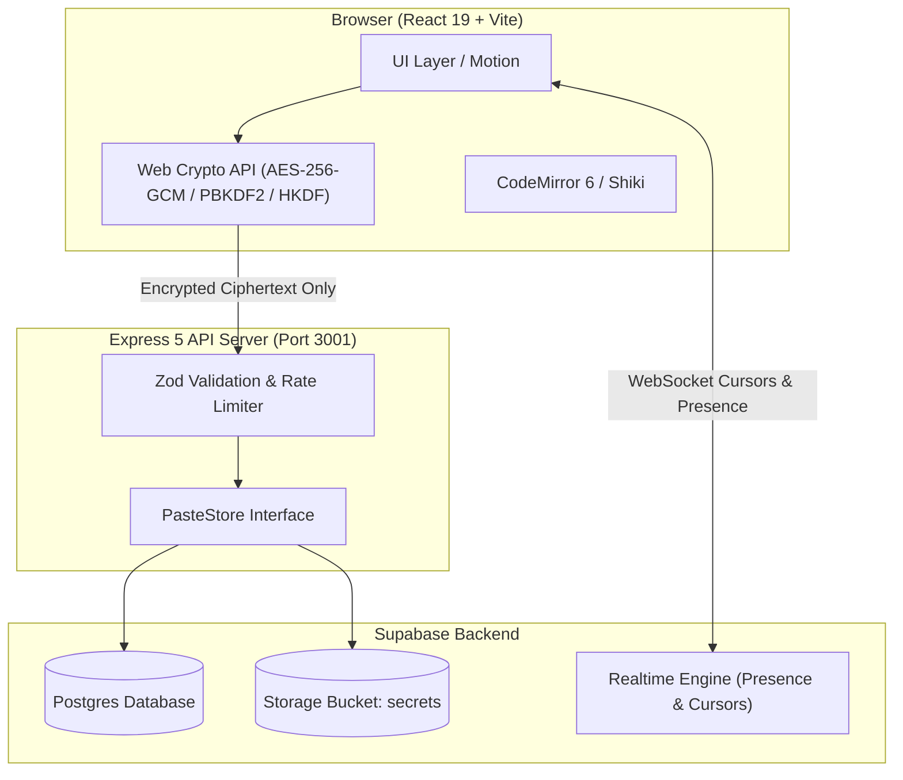
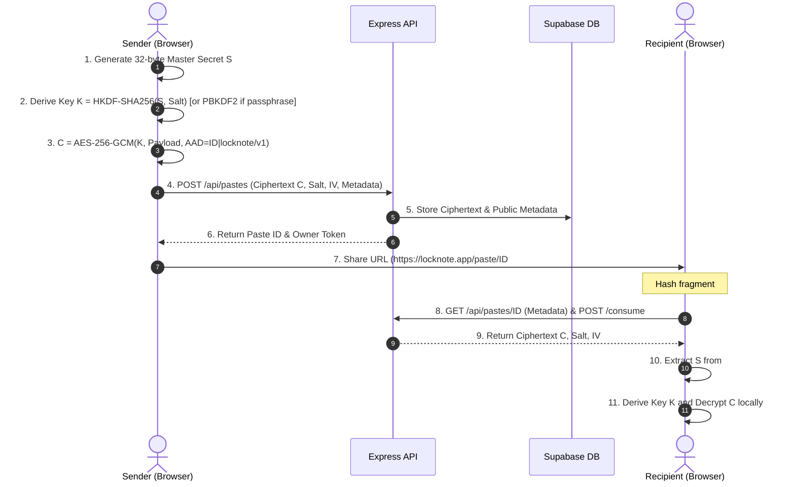

# 📐 Locknote Architecture

Locknote is designed around a strict **Zero-Knowledge Invariant**: the backend server stores and manages ciphertext blobs and metadata, but never receives, generates, logs, or stores decryption keys.

---

## High-Level System Architecture

---

## Zero-Knowledge Encryption Sequence

---

## Database Schema (Postgres)

### `pastes` Table
- `id`: `text primary key` (Client-generated or server fallback)
- `ciphertext`: `text` (Base64url AES-256-GCM payload)
- `salt`: `text` (Public Base64url KDF salt)
- `iv`: `text` (Public Base64url AES IV)
- `iterations`: `integer` (600,000 for PBKDF2, 0 for HKDF)
- `kdf`: `text` (`hkdf` | `pbkdf2`)
- `alg`: `text` (`aes-256-gcm`)
- `format`: `text` (`text` | `markdown` | `code` | `credentials` | `file`)
- `language`: `text` (Optional syntax language)
- `burn_after_read`: `boolean`
- `dead_switch_days`: `integer`
- `storage_path`: `text` (Path in Supabase Storage for files)
- `file_meta`: `jsonb` (`{ size, iv }`)
- `created_at`: `bigint` (Epoch milliseconds)
- `expires_at`: `bigint` (Epoch milliseconds or null)
- `view_count`: `integer`
- `first_viewed_at`: `bigint`
- `last_viewed_at`: `bigint`
- `owner_token`: `text` (Constant-time compared capability token)
- `burned`: `boolean`

### `drafts` Table (Ephemeral Collaboration)
- `room_id`: `text primary key`
- `content`: `text`
- `created_at`: `bigint`
- `updated_at`: `bigint`
- `owner_token`: `text`

---

## Purge & Cleanup Engine (Janitor)

The server runs an automated background janitor every 60 seconds to purge expired secrets and dead-switch triggered pastes:
1. **Time Expiration**: `expires_at <= current_timestamp`
2. **Dead-Switch Inactivity**: `now - max(last_viewed_at, created_at) > dead_switch_days * 86400000`
3. **Draft Cleanup**: Ephemeral rooms older than 24 hours are removed automatically.
