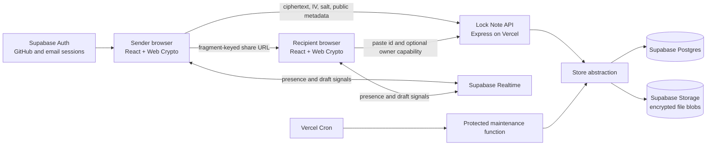
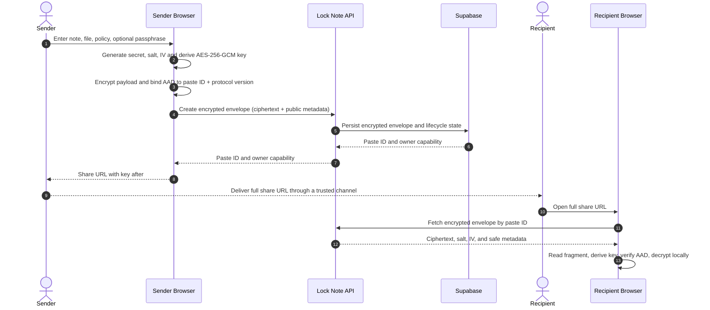

# Lock Note Architecture

## Architectural objective

Lock Note separates three concerns that are commonly conflated in secret-sharing tools:

1. **Confidentiality** is provided by browser-side cryptography.
2. **Lifecycle enforcement** is provided by the API and database state machine.
3. **Availability and operations** are provided by Supabase and Vercel.

The central invariant is that the backend may store, route, delete, and account for an encrypted envelope, but it does not receive the browser-held decryption key from a normal share link.

## System overview



| Boundary | Technology | Responsibility |
| --- | --- | --- |
| Browser client | React 19, TypeScript, Vite, Web Crypto API | Collects note content, derives encryption keys, encrypts/decrypts locally, manages share fragments, renders UX, and hosts Auth/Reatime client integration. |
| API | Express 5, Zod, Helmet, rate limiting | Validates requests, performs lifecycle transitions, verifies owner capabilities, emits safe receipts, deletes encrypted objects, and exposes health state. |
| Persistence | Supabase Postgres and Storage | Holds ciphertext envelopes, encrypted file blobs, lifecycle metadata, draft records, and privacy-safe events. |
| Identity and collaboration | Supabase Auth and Realtime | Manages GitHub/email sessions and temporary pre-seal presence/broadcast collaboration. |
| Deployment | Vercel | Serves the Vite app, hosts `/api` functions, applies production variables, and invokes protected maintenance. |

## Encryption and sharing flow



### Why the URL fragment matters

The share URL has the general form:

```text
https://YOUR_DOMAIN/paste/PASTE_ID#DECRYPTION_MATERIAL
```

The fragment is processed by the browser and is not included in normal HTTP requests. The recipient API request therefore identifies the encrypted envelope by `PASTE_ID`, while key material remains client-side. The sender is still responsible for sharing the entire URL through an appropriate channel.

## Cryptographic model

| Element | Design | Purpose |
| --- | --- | --- |
| Content cipher | AES-256-GCM | Confidentiality and authenticated decryption. |
| Key derivation | HKDF-SHA-256 for generated secrets; PBKDF2 for optional passphrase flows | Derives encryption keys without sending the final key to the API. |
| Key derivation hardness | PBKDF2 uses 600,000 iterations | Raises the cost of passphrase guessing. |
| Additional authenticated data | Paste ID and protocol domain separator | Detects ciphertext or envelope substitution between note identifiers. |
| Per-note randomness | Fresh secret material, salt, and IV | Prevents deterministic encryption output across notes. |
| File handling | File is encrypted before Supabase Storage upload | Keeps Storage objects as encrypted blobs rather than plaintext attachments. |

The detailed trust model, threat scenarios, and limitations are documented in [SECURITY.md](SECURITY.md).

## Data model and lifecycle

| Entity | Contains | Does not contain |
| --- | --- | --- |
| `pastes` | Ciphertext, IV, public salt, format metadata, expiry/dead-switch policy, encrypted-file path, view metadata, owner capability, burned state | Plaintext note content or a fragment-derived decryption key. |
| `events` | Minimal lifecycle and receipt signals | Plaintext content. |
| `drafts` | Short-lived pre-seal collaboration state | Sealed note key material. |
| `secrets` Storage bucket | Encrypted file ciphertext | Plaintext file data or a decryption key. |

The API treats a paste as a lifecycle state machine. It may be active, expired, burned after a successful recipient consume, or withdrawn by its owner capability. Owner preview is explicitly differentiated from recipient consume so the sender can inspect the note without accidentally burning it.

## Collaboration trust boundary

Realtime collaboration is intentionally **pre-seal**. Presence and broadcast signals can support collaborative drafting, but collaborative draft content is not represented as a zero-knowledge encrypted co-editing protocol. Once the owner seals the result, the generated Lock Note envelope follows the browser-side encryption model described above.

This distinction is visible in the product documentation because it prevents a reviewer or user from assuming that realtime drafting has the same confidentiality properties as a sealed note.

## Production deployment behavior

### Vercel routing

The Vercel project serves one deployment:

| Route type | Destination |
| --- | --- |
| Static application routes | Vite `client/dist` output, with SPA fallback for deep links. |
| `/api` | Express Vercel function root entry point. |
| `/api/*` | Explicit catch-all rewrite to the Express Vercel function. |
| `/api/maintenance/purge` | Protected daily maintenance function. |

The explicit nested API rewrite is important: it ensures endpoints such as `/api/pastes/:id`, receipts, drafts, and owner lifecycle operations reach Express instead of Vercel returning a platform `NOT_FOUND` response.

### Runtime safeguards

Production initialization validates the Supabase project URL and required server credentials before enabling the Supabase store. If configuration is invalid, the API reports a controlled service-unavailable response instead of silently presenting an ephemeral in-memory store as durable production persistence.

The public health endpoint reports the active store. A production-ready response should identify `store: "supabase"` and `ok: true`.

### Maintenance

Vercel Cron invokes the protected maintenance endpoint once per day. The endpoint verifies `CRON_SECRET` and performs an idempotent cleanup pass for expired notes, inactive drafts, and orphaned encrypted files. Application requests also enforce lifecycle checks when reading or mutating a record, so expiration does not depend solely on the scheduled job.

## Repository map

```text
Lock_NOTE/
├── client/                    React 19 + Vite application
│   └── src/                   UI, browser crypto, routes, auth, collaboration
├── server/                    Express API, stores, validation, tests, smoke test
│   └── src/
├── api/                       Vercel function entry points and maintenance function
├── docs/                      Evaluation, demo, architecture, security, API, testing
│   └── sql/                   Supabase bootstrap and RLS hardening migrations
├── .env.example               Safe local environment template
├── .env.submission.template   Copyable private-submission template
├── vercel.json                Build, rewrites, headers, and cron configuration
└── README.md                  Primary reviewer entry point
```
