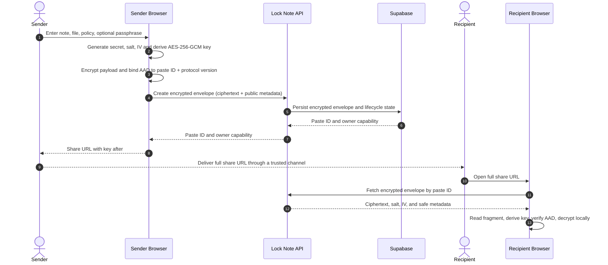

# Lock Note Architecture

## Architectural objective

Lock Note separates three concerns that are commonly conflated in secret-sharing tools:

1. **Confidentiality** is provided by browser-side cryptography.
2. **Lifecycle enforcement** is provided by the API and database state machine.
3. **Availability and operations** are provided by Supabase and Vercel.

The central invariant is that the backend may store, route, delete, and account for an encrypted envelope, but it does not receive the browser-held decryption key from a normal share link.

## System overview


| Boundary | Technology | Responsibility |
| --- | --- | --- |
| Browser client | React 19, TypeScript, Vite, Web Crypto API | Collects note content, derives encryption keys, encrypts/decrypts locally, manages share fragments, renders UX, and hosts Auth/Reatime client integration. |
| API | Express 5, Zod, Helmet, rate limiting | Enforces fixed envelope policy, performs lifecycle transitions, verifies owner/guardian hash verifiers, issues/redeems private one-use file leases, emits proof-based receipt state, deletes encrypted objects, and exposes health state. |
| Persistence | Supabase Postgres and private Storage | Holds ciphertext envelopes, encrypted file blobs, hash-only verifiers, one-use lease state, lifecycle metadata, draft records, and privacy-safe events. |
| Identity and collaboration | Supabase Auth and Realtime | Manages GitHub/email sessions and temporary pre-seal presence/broadcast collaboration. |
| Deployment | Vercel | Serves the Vite app, hosts `/api` functions, applies production variables, and invokes protected maintenance. |

## Encryption and sharing flow



### Why the URL fragment matters

The share URL has the general form:

```text
https://YOUR_DOMAIN/paste/PASTE_ID#DECRYPTION_MATERIAL
```

The fragment is processed by the browser and is not included in normal HTTP requests. The recipient API request therefore identifies the encrypted envelope by `PASTE_ID`, while key material remains client-side. The sender is still responsible for sharing the entire URL through an appropriate channel.

## Cryptographic model

| Element | Design | Purpose |
| --- | --- | --- |
| Content cipher | AES-256-GCM | Confidentiality and authenticated decryption. |
| Key derivation | HKDF-SHA-256 for generated secrets; PBKDF2 for optional passphrase flows | Derives encryption keys without sending the final key to the API. |
| Key derivation hardness | PBKDF2 uses 600,000 iterations | Raises the cost of passphrase guessing. |
| Additional authenticated data | Paste ID and protocol domain separator | Detects ciphertext or envelope substitution between note identifiers. |
| Per-note randomness | Fresh secret material, salt, and IV | Prevents deterministic encryption output across notes. |
| File handling | File is encrypted before private Supabase Storage upload | Keeps Storage objects as encrypted blobs rather than plaintext attachments or public URLs. |
| Delivery proof | A random 32-byte proof is encrypted inside a v2 envelope; only its SHA-256 base64url verifier is stored | Lets the API record one verified encrypted-envelope acknowledgement without receiving the raw proof at creation. |
| Guardian Wipe | A separate random revocation capability is split in the browser; only its SHA-256 verifier is stored | Lets a trustee quorum revoke future server delivery without receiving a decryption key or content key. |

The detailed trust model, threat scenarios, and limitations are documented in [SECURITY.md](SECURITY.md).

## Verified delivery, private files, and Guardian Wipe

```mermaid
sequenceDiagram
    autonumber
    participant S as Sender browser
    participant R as Recipient/guardian browser
    participant A as Lock Note API
    participant P as Supabase Postgres
    participant O as Private Storage

    S->>S: Encrypt v2 envelope containing random receipt proof
    S->>S: Create separate Guardian Wipe capability and cards (optional)
    S->>A: Ciphertext + SHA-256(proof) + SHA-256(wipe capability)
    A->>P: Store ciphertext and hash-only verifiers
    R->>A: Consume encrypted envelope
    alt encrypted file
        A->>P: Persist 60-second one-use lease hash (with burn, atomically)
        A-->>R: Envelope + lease token; never Storage path
        R->>A: Redeem lease once
        A->>O: Read encrypted bytes through service role
        A-->>R: Ciphertext bytes with no-store
    end
    R->>R: Decrypt locally and recover proof
    R->>A: Raw proof after successful local decrypt
    A->>P: Match hash once and record verified acknowledgement
    opt Guardian revocation
        R->>R: Reconstruct separate capability from K-of-N cards locally
        R->>A: Reconstructed capability only
        A->>P: Match guardian hash and delete server record
    end
```

A delivery receipt establishes an authenticated envelope-open acknowledgement, not human comprehension. Guardian cards neither include nor reconstruct a content key, delivery URL, passphrase, plaintext, or receipt proof. A private file lease is a short-lived delivery capability, not a decryption key; its token is removed on successful redemption.

## Data model and lifecycle

| Entity | Contains | Does not contain |
| --- | --- | --- |
| `pastes` | Ciphertext, fixed KDF inputs, format metadata, expiry/dead-switch policy, server-only encrypted-file path, receipt-proof hash, receipt state, Guardian Wipe hash/policy, hash-only file lease state, owner capability, burned state | Plaintext note content, fragment-derived decryption key, raw receipt proof, Guardian capability/share, or a public file URL. |
| `events` | Minimal lifecycle and receipt signals | Plaintext content. |
| `drafts` | Short-lived pre-seal collaboration state | Sealed note key material. |
| `secrets` private Storage bucket | Encrypted file ciphertext, readable only by the server-side service role | Plaintext file data, a decryption key, or browser direct-object access. |
| `profiles` | Opt-in display name, provider username, avatar URL, and a short bio for the authenticated owner | Notes, ciphertext, share URLs, URL fragments, passphrases, owner capabilities, or cryptographic material. |
| `vault_contacts` | Authenticated owner’s private GitHub username shortcuts | Recipient access grants, collaboration permissions, notes, share URLs, or key material. |

The API treats a paste as a lifecycle state machine. It may be active, expired, burned after a successful recipient consume, or withdrawn by an owner capability or Guardian Wipe quorum. Owner preview is explicitly differentiated from recipient consume so the sender can inspect the note without accidentally burning it. For a burn-after-read encrypted file, a conditional Postgres update marks the record burned and persists its lease hash together, avoiding the prior failure mode where a record could burn before any redeemable file lease existed. For a non-burn file, a transient lease-issuance failure remains retryable because the record stays active.

## Collaboration trust boundary

Realtime collaboration is intentionally **pre-seal**. Presence and broadcast signals can support collaborative drafting, but collaborative draft content is not represented as a zero-knowledge encrypted co-editing protocol. Once the owner seals the result, the generated Lock Note envelope follows the browser-side encryption model described above.

This distinction is visible in the product documentation because it prevents a reviewer or user from assuming that realtime drafting has the same confidentiality properties as a sealed note.

## Production deployment behavior

### Vercel routing

The Vercel project serves one deployment:

| Route type | Destination |
| --- | --- |
| Static application routes | Vite `client/dist` output, with SPA fallback for deep links. |
| `/api` | Express Vercel function root entry point. |
| `/api/*` | Explicit catch-all rewrite to the Express Vercel function. |
| `/api/maintenance/purge` | Protected daily maintenance function. |

The explicit nested API rewrite is important: it ensures endpoints such as `/api/pastes/:id`, receipts, drafts, and owner lifecycle operations reach Express instead of Vercel returning a platform `NOT_FOUND` response.

### Runtime safeguards

Production initialization validates the Supabase project URL and required server credentials before enabling the Supabase store. If configuration is invalid, the API reports a controlled service-unavailable response instead of silently presenting an ephemeral in-memory store as durable production persistence.

The public health endpoint reports the active store and a safe build identifier. A production-ready response should identify `store: "supabase"` and `ok: true`.

### Account metadata and route protection

The client restores the Supabase session through `AuthProvider`; `/dashboard` and `/profile` use `RequireAuth` rather than treating a browser cache as proof of identity. The OAuth callback stores a safe local return path in session storage, exchanges the PKCE code, and sends the user back only to a same-origin application route.

The profile screen calls Supabase directly with the browser publishable key and the signed-in user’s JWT. `profiles` and `vault_contacts` are protected by owner-only RLS policies, so no service-role credential is ever bundled to the client. First-time profile initialization stores only provider-derived display metadata and an optional bio. Browser-local tracked paste capabilities deliberately remain outside these account tables because they can include owner tokens and full share URLs.

### Static delivery security and telemetry

`vercel.json` applies an enforced Content Security Policy to static routes, alongside a restrictive Permissions Policy, `nosniff`, frame protection, COOP, CORP, and a strict referrer policy. The CSP explicitly permits only application assets, the required Google Fonts sources, GitHub/DiceBear avatar sources, and Supabase HTTPS/WebSocket connections; changes to those dependencies must be tested before the policy is widened.

Every API response receives an `X-Request-ID` and `Server-Timing` header. Completion logs record only request ID, HTTP method, a normalized route template, status, and duration. Error logs retain only a safe error class. They never include request bodies, ciphertext, plaintext, URL fragments, passphrases, authorization values, owner capabilities, or user-defined route identifiers.

### Maintenance

Vercel Cron invokes the protected maintenance endpoint once per day. The endpoint verifies `CRON_SECRET` and performs an idempotent cleanup pass for expired notes, inactive drafts, and orphaned encrypted files. Application requests also enforce lifecycle checks when reading or mutating a record, so expiration does not depend solely on the scheduled job.

## Repository map

```text
Lock_NOTE/
├── client/                    React 19 + Vite application
│   └── src/                   UI, browser crypto, routes, auth, collaboration
├── server/                    Express API, stores, validation, tests, smoke test
│   └── src/
├── api/                       Vercel function entry points and maintenance function
├── docs/                      Evaluation, demo, architecture, security, API, testing
│   └── sql/                   Supabase bootstrap and RLS hardening migrations
├── .env.example               Safe local environment template
├── .env.submission.template   Copyable private-submission template
├── vercel.json                Build, rewrites, headers, and cron configuration
└── README.md                  Primary reviewer entry point
```
