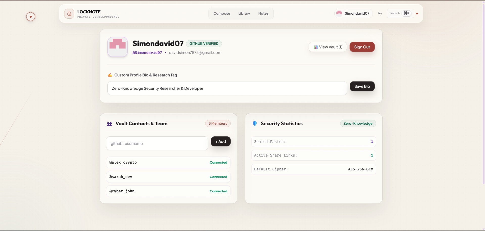
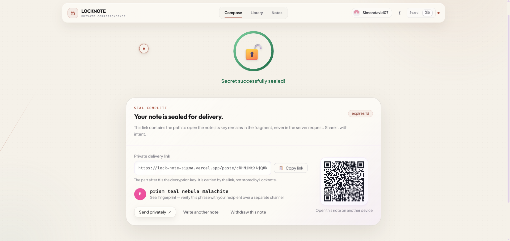
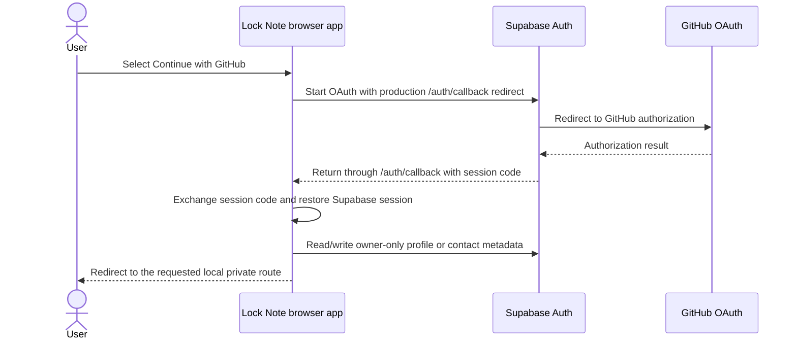

# Lock Note Feature Guide

This guide documents the product experience shown in the live application and screenshots. It explains both **what the user sees** and **where the relevant state lives**, which is important for a zero-knowledge application.

## Feature map

| Area | User-facing capability | Privacy and implementation boundary |
| --- | --- | --- |
| Secure sealing | Encrypt a text note or file before upload. | Browser uses Web Crypto; API persists ciphertext and lifecycle metadata. |
| Private share links | Copy or privately share a fragment-keyed delivery URL. | Decryption material lives after `#` and is not sent in ordinary HTTP requests. |
| QR delivery | Render the complete private share link as a QR code for another device. | The QR code represents the same sensitive full link, including the fragment; display it only to the intended recipient. |
| Integrity fingerprint | Compare a four-word/visual seal fingerprint over a second channel. | Derived from the sealed-envelope context; it is a human verification aid, not a replacement for trusted link delivery. |
| Recipient lifecycle | Burn after read, expiry, and passphrase protection. | API manages eligibility and lifecycle state while browser performs decryption. |
| Sender controls | Owner preview, view receipts, and remote withdrawal. | Owner capability is held in the sender browser session for that sealed note. |
| GitHub authentication | Continue with GitHub through Supabase Auth. | GitHub OAuth client credentials are stored in Supabase provider settings, not the repository or browser bundle. |
| Personal profile | View provider identity, avatar, username, email, and edit an optional bio/research tag. | Provider identity comes from the authenticated session; the optional bio is stored in an owner-only Supabase `profiles` row. It never contains secret content or key material. |
| Personal vault | Review tracked notes, active links, burn state, and sender controls. | The vault is a browser-local management view for capability-bearing links created in that browser; it is not a server-visible plaintext archive. |
| Vault contacts | Add or remove private GitHub username shortcuts. | Contacts are stored in owner-only Supabase `vault_contacts` rows. They are not a public directory, access-control system, share recipient, or decryption permission. |
| Pre-seal collaboration | Join a temporary draft workflow before sealing the final note. | Drafting is explicitly not described as end-to-end encrypted co-editing; sealing starts the encrypted-note boundary. |

## Visual product proof

### GitHub-authenticated personal profile and vault

After a user completes GitHub OAuth through Supabase Auth, the profile page presents the authenticated provider identity: avatar, display name, GitHub username, email, and a provider-verified badge. The user can personalize a research bio/tag and move into the vault dashboard, which summarizes notes tracked by that browser and their active share state.

| Visible element | What it demonstrates |
| --- | --- |
| Provider-verified identity badge | The profile reflects the authenticated GitHub provider session. |
| Avatar, username, and email | Identity information is rendered from the browser’s authenticated profile data. |
| Custom profile bio/research tag | A user can save an optional ≤160-character account bio in their owner-only profile row. |
| View Vault | Opens the browser-local note management dashboard. |
| Vault contacts | Provides a private, account-scoped GitHub username shortcut list for visual organization. |
| Security Statistics | Shows locally tracked sealed notes, active links, and the default AES-256-GCM cipher. |
| Sign out | Revokes the Supabase session, clears the presentation cache, and returns to the compose flow. |

> **Accurate state note:** the optional bio and contact list are private account metadata protected by owner-only RLS. They are not a server-synchronized social graph, and they do not grant a contact permission to decrypt a note. Capability-bearing links, owner tokens, share URLs, URL fragments, keys, passphrases, and note content remain outside these tables.

### Sealed delivery, QR handoff, and sender controls

The post-seal delivery card makes the security model visible. It distinguishes the server addressable part of the link from the fragment-held key, shows the note’s lifecycle policy, and provides multiple intentional ways to hand off the same encrypted envelope.

| Visible element | What it demonstrates |
| --- | --- |
| “Secret successfully sealed” state | The browser has completed the creation workflow and received the encrypted-envelope identifier. |
| Private delivery link | Sender can select or copy the complete share URL. |
| Fragment explanation | The UI explicitly explains that the portion after `#` is carried by the link and not stored by Lock Note. |
| Expiry / burn / passphrase badges | Lifecycle policy is visible before a sender shares the note. |
| Seal fingerprint | Sender and recipient can compare a compact fingerprint over a separate trusted channel. |
| QR code | Encodes the full delivery link for convenient cross-device opening. |
| Native share action | Uses browser-supported private-share flows when available. |
| Withdraw action | Lets the owner invalidate an active encrypted envelope remotely. |

> **QR security note:** a QR code is a transport representation of the full share URL. Anyone who can scan or photograph it can receive the same decryption material. Use it only in a private, intended-recipient context.

## Advanced composer and security-transparency tools

Lock Note also exposes the reasoning behind its privacy controls instead of treating security as invisible background behavior.

| Feature | User benefit | Where it appears |
| --- | --- | --- |
| Structured editor | Compose text, markdown, code, credentials, or encrypted-file notes in an intentional editor workflow. | Compose page. |
| Lifecycle policy controls | Set burn-after-read, a time expiry, a passphrase gate, or a dead-switch policy before sealing. | Compose page. |
| Security score gauge | Provides a visible strength summary based on the selected note policy and protection choices. | Compose page. |
| Hex dump inspector | Lets a user inspect the input representation in a focused security-oriented workflow. | Compose page. |
| Crypto matrix | Explains the selected encryption and key-derivation approach in a dedicated modal. | Compose page. |
| Threat model modal | Makes residual risks and user responsibilities visible before sharing. | Compose page. |
| Comparison modal | Presents Lock Note’s design differences from a classic pastebin workflow. | Compose page. |
| Syntax-aware rendering | Presents note formats in a suitable renderer after successful client-side decryption. | Recipient view. |
| Expiry countdown | Shows remaining time for active expiring notes. | Recipient view. |
| Command palette | Opens with `⌘K` or `Ctrl+K`, supports arrow navigation and Escape dismissal. | Available application-wide. |
| Skip link and focus treatment | Keyboard users can skip repeated navigation and identify focused native controls. | Application shell and shared UI controls. |
| Motion preference support | The sealed-delivery card and custom cursor respect a browser reduced-motion preference; the cursor is limited to fine-pointer devices. | Delivery flow and application shell. |

These tools are designed to support a **transparent security experience**. A user can understand policy consequences, see lifecycle state, and learn the trust boundary without being required to read the source code first.

## GitHub authentication flow

The browser uses Supabase Auth rather than handling a GitHub authorization-code exchange in the Lock Note API. GitHub client secrets remain in the Supabase provider configuration. The deployed flow was verified end-to-end through the production callback and dashboard redirect.

## Personal vault behavior

The personal vault is deliberately a **management view for the current browser**, not a cloud archive of decrypted data. When a user seals a note, the browser tracks the link, owner capability, and lifecycle state needed to help the sender copy the link, inspect receipts, or withdraw it later. The decrypted plaintext is not added to the vault record.

| Vault statistic | Interpretation |
| --- | --- |
| Sealed pastes | Number of links this browser has tracked after creation. |
| Active share links | Tracked notes not currently marked burned in the local management view. |
| Default cipher | The envelope encryption algorithm used by the product: AES-256-GCM. |

Users should understand that browser-local tracking is device-specific. Clearing browser storage, switching browsers, or opening a private window does not transfer owner capabilities or dashboard history automatically.

## Secure delivery workflow

1. Compose a note, choose a lifecycle policy, and seal it.
2. Copy the full share link, use the supported native-share option, or display the QR code on a private trusted screen.
3. Optionally send the passphrase over a different channel.
4. Compare the seal fingerprint with the recipient when stronger assurance is needed.
5. Use the sender vault to preview, inspect a receipt, or withdraw the note while it remains active.
6. The recipient opens the full link, retrieves ciphertext, and decrypts in-browser.

## Accessibility and interaction details

| Feature | Accessibility consideration |
| --- | --- |
| QR code | Includes descriptive alternative text identifying it as the QR code for the sealed paste. |
| Copyable link | Uses a labeled read-only field, supports selection on focus, and provides an explicit copy control. |
| Provider profile | Avatar includes the user’s username as alternative text. |
| Status badges | Policy states are expressed with labels such as “burn after read,” “passphrase protected,” and “expires,” not color alone. |
| Reduced motion | Completion card respects the browser reduced-motion preference. |
| Native sharing | Offered only on browsers that support the Web Share API; the copy control remains available. |
| Automated accessibility | Playwright plus axe blocks serious/critical public-route issues and verifies command-palette Escape plus skip-link keyboard behavior. |

## Reviewer demo references

Use this guide with [DEMO.md](DEMO.md) and [EVALUATION.md](EVALUATION.md). The recommended live sequence is: sign in with GitHub, show the profile/vault boundary, seal a short test note, point out the fragment and fingerprint, show QR delivery, open as a recipient, and finally show the owner controls in the vault.
